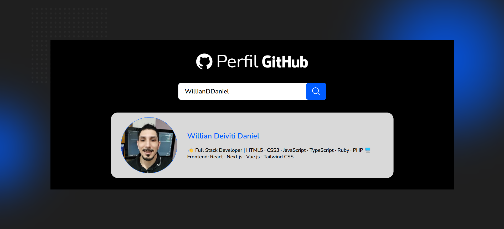

# Buscador de Perfis no GitHub


Uma aplicação web simples e elegante que permite buscar e visualizar perfis de usuários do GitHub de forma rápida.



## 📋 Sobre o projeto

O Buscador de Perfis no GitHub é uma aplicação React que consome a API pública do GitHub para exibir informações sobre qualquer usuário da plataforma. Basta digitar o nome de usuário desejado e visualizar detalhes do perfil instantaneamente!

### [Acesse a versão online aqui](https://willianddaniel.github.io/github-profile-search/)

### 🚀 Desafio Técnico
- **Prazo de Entrega:** 25/04/2025
- **Proponente:** [Avanti - Innovation Class](https://penseavanti.com.br/ecommerce/lp-carreiras-innovation-class/)
- **Objetivo:** Desenvolver uma aplicação web que permita buscar e visualizar perfis de usuários do GitHub de forma rápida.

### ✨ Funcionalidades

- Busca de usuários do GitHub por nome de usuário
- Exibição de informações do perfil (nome, bio, avatar)
- Interface responsiva e amigável
- Tratamento de erros para usuários inexistentes
- Design moderno e intuitivo

## 🚀 Tecnologias utilizadas

- [React](https://reactjs.org/)
- [GitHub API](https://docs.github.com/en/rest)
- [Vite](https://vite.dev/)
- CSS (componentes estilizados)
- JavaScript (ES6+)

## 📦 Estrutura do projeto

```
src/
├── components/
│   ├── Background.jsx
│   ├── Container.jsx
│   ├── Header.jsx
│   ├── SearchInput.jsx
│   ├── UserCard.jsx
│   └── UserNotFound.jsx
└── App.jsx
```

## 🔧 Como executar

Siga estes passos para executar o projeto localmente:

- Obs: Voce precisa ter [Node.js](https://nodejs.org) e NPM instalados

1. Clone o repositório
   ```bash
   git clone https://github.com/WillianDDaniel/github-profile-search.git
   ```

2. Navegue até a pasta do projeto
   ```bash
   cd github-profile-search
   ```

3. Instale as dependências
   ```bash
   npm install
   ```

4. Execute a aplicação
   ```bash
   npm run dev
   ```

5. Acesse a aplicação em seu navegador
   ```
   http://localhost:5173
   ```

## 📱 Uso da aplicação

1. Na tela inicial, você encontrará um campo de busca
2. Digite o nome de usuário do GitHub que deseja buscar
3. Pressione Enter ou clique no botão de busca
4. As informações do perfil serão exibidas
5. Caso o usuário não seja encontrado, uma mensagem de erro será exibida

## 🔍 Como funciona

A aplicação utiliza a [API pública do GitHub](https://docs.github.com/en/rest) para buscar informações dos usuários. Quando um nome de usuário é buscado, uma requisição é feita para o endpoint `https://api.github.com/users/{username}`, e os dados retornados são exibidos na interface.

```javascript
async function getUser(userName) {
  const url = `https://api.github.com/users/${userName}`

  try {
    const response = await fetch(url)
    const user = await response.json()

    if (response.ok) {
      return setUser(user)
    }

    setUser(false)
  }
  catch (error) {
    setUser(false)
  }
}
```

## 📌 Requisitos Atendidos

- Busca de usuários do GitHub por nome de usuário
- Exibição de informações do perfil (nome, bio, avatar)
- Tratamento de erros para usuários inexistentes

## 👨‍💻 Autor


Desenvolvido com ❤️ por [Willian D. Daniel](https://willianddaniel.github.io/portfolio/)